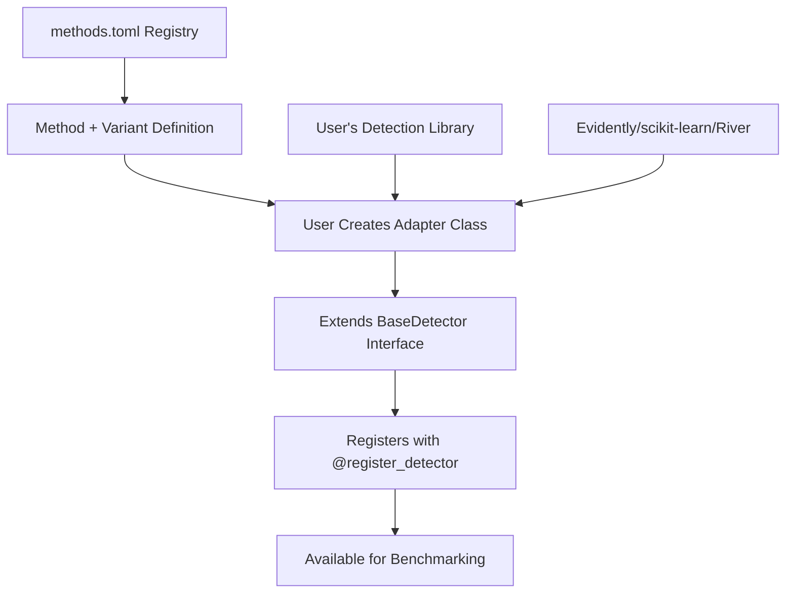

# drift-benchmark

> A comprehensive benchmarking framework for drift detection methods

[](https://www.python.org/downloads/)
[](https://github.com/psf/black)

**drift-benchmark** is a unified framework for evaluating and comparing drift detection methods across different datasets and scenarios. It provides a standardized interface for benchmarking various drift detection algorithms, enabling researchers and practitioners to objectively assess performance and choose the most suitable methods for their specific use cases.

**🎯 Primary Goal**: Compare how different libraries (Evidently, Alibi-Detect, River, etc.) implement the same mathematical methods within well-defined "Scenarios" to identify which library provides better performance, accuracy, or resource efficiency for your specific use case.

## 🏗️ Framework Architecture

**drift-benchmark** acts as a **standardization layer** that enables fair comparison of drift detection implementations across different libraries. The framework provides:

- **📋 Standardized Method+Variant Definitions**: Consistent algorithmic approaches (variants) for each mathematical method
- **⚙️ Library-Agnostic Interface**: Compare how different libraries implement the same method+variant
- **📊 Performance Benchmarking**: Evaluate speed, accuracy, and resource usage across implementations
- **🔬 Statistical Validation**: Scientifically rigorous comparisons with quantitative measurements
- **🔄 Fair Comparisons**: All libraries tested under identical conditions and data preprocessing

### 📚 Core Concepts

- **🔬 Method**: Mathematical methodology for drift detection (e.g., Kolmogorov-Smirnov Test, Maximum Mean Discrepancy)
- **⚙️ Variant**: Standardized algorithmic approach defined by drift-benchmark (e.g., batch processing, incremental processing, sliding window)
- **🔌 Detector**: How a specific library implements a method+variant combination (e.g., Evidently's KS batch vs. Alibi-Detect's KS batch)
- **🔄 Adapter**: Your custom class that maps a library's implementation to our standardized method+variant interface
- **🎯 Scenario**: The primary unit of evaluation, generated from source datasets with ground-truth drift information and complete evaluation metadata

### 🎯 Framework Roles

#### **Framework Provides:**

- Design and maintain the `methods.toml` registry that standardizes drift detection methods across libraries
- Provide the `BaseDetector` abstract interface for consistent detector integration
- Implement core benchmarking infrastructure (scenario loading, execution, results)
- Define standardized scenario formats with ground-truth drift information

#### **Users Implement:**

- Create **adapter classes** by extending `BaseDetector` to integrate their preferred drift detection libraries
- Configure benchmarks using our standardized method+variant identifiers and scenario definitions
- Run comparative evaluations across different detectors using well-defined scenarios with ground truth

### 🔄 Integration Flow



**Key Insight**: Libraries like Evidently or Alibi-Detect don't define variants themselves. Instead, **drift-benchmark defines standardized variants** (like "batch" or "incremental"), and users create adapters that map their library's specific implementation to match our variant specifications.

## 🎯 Features

### Core Capabilities

- **📋 Standardized Registry**: Curated `methods.toml` defining mathematical methods and their algorithmic variants
- **🔌 Unified Interface**: Consistent `BaseDetector` API for integrating any drift detection library
- **📊 Flexible Data Handling**: Support for pandas DataFrames and automatic conversion to library-specific formats
- **📈 Comprehensive Evaluation**: Performance metrics including accuracy, precision, recall, and execution time
- **🧪 Statistical Rigor**: Quantitative measurements and power analysis for scientifically valid comparisons
- **🗂️ Multiple Data Types**: Support for continuous, categorical, and mixed data types
- **⚙️ Configurable Benchmarks**: TOML-based configuration for reproducible experiments

### Supported Drift Types

- **Covariate Drift**: Changes in input feature distributions
- **Concept Drift**: Changes in the relationship between features and target
- **Prior Drift**: Changes in target variable distribution

### Data Format Support

- **Scenario Files**: TOML-based scenario definitions with ground-truth drift information
- **Multiple Data Sources**: Support for synthetic datasets, CSV files, and UCI ML Repository integration
- **Univariate & Multivariate**: Support for single and multiple feature scenarios
- **Advanced Filtering**: Configurable reference/test data filtering through scenario definitions
- **Ground Truth Integration**: Specify drift periods and types for evaluation metrics
- **Dataset Categorization**: Intelligent handling of synthetic vs. real datasets (UCI and CSV files)
- **UCI Repository Access**: Direct integration with ucimlrepo for accessing over 500 diverse real-world datasets

## 🚀 Quick Start

### Installation

```bash
# Clone the repository
git clone https://github.com/BorjaEst/drift-benchmark.git
cd drift-benchmark

# Install dependencies (includes UCI ML Repository integration)
pip install -r requirements.txt

# Install in development mode
pip install -e .

# For UCI dataset access
pip install ucimlrepo
```

### Basic Usage

#### 1. Configuration Setup

Create a benchmark configuration file (`benchmark_config.toml`):

```toml
# Scenario-based configuration
[[scenarios]]
id = "covariate_drift_example"

[[scenarios]]
id = "concept_drift_example"

# Compare different library implementations of the same method+variant
[[detectors]]
method_id = "kolmogorov_smirnov"
variant_id = "batch"
library_id = "evidently"

[[detectors]]
method_id = "kolmogorov_smirnov"
variant_id = "batch"
library_id = "alibi-detect"

# Also compare different methods
[[detectors]]
method_id = "cramer_von_mises"
variant_id = "batch"
library_id = "scipy"
```

Create scenario definition files (e.g., `scenarios/covariate_drift_example.toml`):

**Synthetic Dataset Example** (modifications allowed):

```toml
description = "Synthetic classification with artificial covariate drift"
source_type = "synthetic"
source_name = "classification"
target_column = "target"
drift_types = ["covariate"]

# Ground truth specification for evaluation
[ground_truth]
drift_periods = [[500, 1000]]  # Drift occurs in samples 500-1000
kl_divergence = 0.45           # Expected KL divergence between distributions
effect_size = 0.65             # Expected Cohen's d effect size

# Statistical validation for scientific rigor
[statistical_validation]
expected_effect_size = 0.65    # Quantitative effect size expectation
minimum_power = 0.80           # Statistical power requirement (80%)
alpha_level = 0.05             # Significance level (5%)

# Filter conditions for reference data (non-drift period)
[ref_filter]
sample_range = [0, 500]               # Use samples 0-500 as reference

# Filter conditions for test data (with artificial drift)
[test_filter]
sample_range = [500, 1000]            # Use samples 500-1000 as test
noise_factor = 1.5                    # Synthetic datasets: increase noise
n_samples = 1500                      # Synthetic datasets: control generation
random_state = 42                     # Synthetic datasets: reproducibility
```

**UCI Repository Dataset Example** (feature-based filtering only):

```toml
description = "UCI Wine Quality dataset with authentic drift based on alcohol content"
source_type = "uci"
source_name = "wine-quality-red"      # UCI dataset identifier
target_column = "quality"
drift_types = ["covariate"]

# Ground truth specification for evaluation
[ground_truth]
drift_periods = [[0, 1599]]           # Drift through feature-based sampling
kl_divergence = 0.42                  # Expected quantitative drift measurement
effect_size = 0.58                    # Expected Cohen's d effect size

# Statistical validation for scientific rigor
[statistical_validation]
expected_effect_size = 0.58           # Quantitative effect size expectation
minimum_power = 0.80                  # Statistical power requirement (80%)
alpha_level = 0.05                    # Significance level (5%)

# Reference data: low alcohol wines (authentic light wine population)
[ref_filter]
sample_range = [0, 1599]
feature_filters = [
    {column = "alcohol", condition = "<=", value = 10.5}
]

# Test data: high alcohol wines (authentic strong wine population)
[test_filter]
sample_range = [0, 1599]
feature_filters = [
    {column = "alcohol", condition = ">", value = 12.0}
]
```

**CSV File Dataset Example** (feature-based filtering only):

```toml
description = "CSV file dataset with authentic drift patterns"
source_type = "file"
source_name = "datasets/my_dataset.csv"    # Path to CSV file
target_column = "target"
drift_types = ["covariate"]

# Ground truth specification for evaluation
[ground_truth]
drift_periods = [[0, 1000]]           # Drift through feature-based sampling
kl_divergence = 0.38                  # Expected quantitative drift measurement
effect_size = 0.55                    # Expected Cohen's d effect size

# Statistical validation for scientific rigor
[statistical_validation]
expected_effect_size = 0.55           # Quantitative effect size expectation
minimum_power = 0.80                  # Statistical power requirement (80%)
alpha_level = 0.05                    # Significance level (5%)

# Reference data: filtered by feature conditions
[ref_filter]
sample_range = [0, 1000]
feature_filters = [
    {column = "feature_1", condition = "<=", value = 0.5}
]

# Test data: different feature conditions for drift
[test_filter]
sample_range = [0, 1000]
feature_filters = [
    {column = "feature_1", condition = ">", value = 0.5}
]
```

> **Note**: For CSV file scenarios, you'll need to provide your own dataset files in the `datasets/` directory. Only feature-based filtering is allowed to preserve data authenticity.

**Important**: Each drift scenario should have a corresponding no-drift baseline scenario for statistical validation:

```toml
# Example: covariate_drift_baseline.toml (companion to covariate_drift_example.toml)
description = "No-drift baseline for statistical comparison"
source_type = "synthetic"
source_name = "classification"
target_column = "target"
drift_types = ["none"]

[ground_truth]
drift_periods = []              # No drift periods
expected_detection = false      # Should NOT detect drift

# Statistical validation
[statistical_validation]
minimum_power = 0.80           # Validate false positive rate < 5%

[ref_filter]
sample_range = [0, 500]

[test_filter]
sample_range = [501, 1000]     # Different samples, no drift modifications
```

#### Set-Level Evaluation

Each scenario is designed to test either **drift** or **non-drift** conditions:

- **Drift scenarios**: `test_filter` extracts samples from drift periods → ground truth = "drift detected"
- **Non-drift scenarios**: `test_filter` extracts samples from non-drift periods → ground truth = "no drift"

Detectors provide a single boolean prediction per scenario, enabling meaningful accuracy/precision/recall calculations across multiple scenarios.

#### Data Authenticity

The framework maintains data authenticity by treating synthetic datasets differently from real data sources:

**Synthetic Datasets** (`classification`, `regression`, `blobs`, etc.): Generate artificial drift through parameter modifications (noise injection, feature scaling, etc.). These scenarios test detector sensitivity to controlled, artificial changes.

**UCI Datasets** (`uci` source_type): Access diverse real-world datasets from the UCI Machine Learning Repository with comprehensive metadata. Only feature-based filtering is allowed to preserve data authenticity, leveraging natural variation and correlations already present in real-world data.

**CSV File Datasets** (`file` source_type): Load datasets from local CSV files. Similar to UCI datasets, only feature-based filtering is allowed to preserve data authenticity and leverage existing patterns in your data.

**Supported Filter Operations**:

- `sample_range: [start, end]` - Use specific index range with inclusive endpoints
- `feature_filters: [{column, condition, value}, ...]` - Feature-based filtering with AND logic
  - Supported conditions: `"<="`, `">="`, `">"`, `"<"`, `"=="`, `"!="`
  - Multiple filters applied with AND logic (all conditions must be true)
- `noise_factor: float` - Control noise level for artificial drift
- `n_samples: int` - Control dataset generation size  
- `random_state: int` - Control randomness for reproducibility
- Other sklearn-specific parameters as supported by the dataset function

> **Note**: For scenarios with real datasets, avoid modification parameters like `noise_factor` to preserve data authenticity.  
> **Security**: No support for arbitrary Python expressions - only predefined filter operations

#### 2. Run Benchmark

```python
from drift_benchmark import BenchmarkRunner

# Load configuration and run benchmark
runner = BenchmarkRunner.from_config_file("benchmark_config.toml")
results = runner.run()

# Results are automatically saved to timestamped directory
print(f"Results saved to: {results.output_directory}")
```

#### 3. Compare Library Performance

```python
# Access individual detector results to compare implementations
for result in results.detector_results:
    print(f"Library: {result.library_id}")
    print(f"Method+Variant: {result.method_id}_{result.variant_id}")
    print(f"Scenario: {result.scenario_name}")
    print(f"Drift Detected: {result.drift_detected}")
    print(f"Execution Time: {result.execution_time:.4f}s")
    print(f"Drift Score: {result.drift_score}")
    print("---")

# Example output:
# Library: evidently
# Method+Variant: kolmogorov_smirnov_batch
# Scenario: covariate_drift_example
# Execution Time: 0.0234s
# ---
# Library: alibi-detect
# Method+Variant: kolmogorov_smirnov_batch
# Scenario: covariate_drift_example
# Execution Time: 0.0156s  <- Alibi-Detect is faster!
# ---

# View summary statistics
summary = results.summary
print(f"Total Detectors: {summary.total_detectors}")
print(f"Successful Runs: {summary.successful_runs}")
print(f"Failed Runs: {summary.failed_runs}")
print(f"Average Execution Time: {summary.avg_execution_time:.4f}s")
```

## 📊 Architecture

### Module Structure

```text
src/drift_benchmark/
├── __init__.py              # Package initialization
├── settings.py              # Configuration management
├── exceptions.py            # Custom exception classes
├── literals.py              # Type definitions and enums
├── models/                  # Pydantic data models
│   ├── __init__.py
│   ├── configurations.py    # Config models (BenchmarkConfig, ScenarioConfig)
│   ├── results.py          # Result models (BenchmarkResult, DetectorResult, ScenarioResult)
│   └── metadata.py         # Metadata models (ScenarioDefinition, ScenarioMetadata, DetectorMetadata)
├── detectors/              # Method registry and metadata
│   ├── __init__.py
│   ├── methods.toml        # Standardized method+variant definitions
│   └── registry.py         # Method loading and lookup
├── adapters/               # Detector interface framework
│   ├── __init__.py
│   ├── base_detector.py    # BaseDetector abstract class
│   └── registry.py         # Detector registration system
├── data/                   # Scenario loading utilities
│   ├── __init__.py
│   └── scenario_loader.py  # Scenario loading utilities
├── config/                 # Configuration loading
│   ├── __init__.py
│   └── loader.py           # TOML configuration parsing
├── benchmark/              # Benchmark execution
│   ├── __init__.py
│   ├── core.py             # Benchmark class
│   └── runner.py           # BenchmarkRunner class
└── results/                # Result storage and export
    ├── __init__.py
    └── storage.py          # Result saving and export
```

### Data Flow Pipeline

1. **Configuration Loading**: Parse TOML configuration files with validation
2. **Scenario Loading**: Load scenario definitions and generate ScenarioResult objects with ground-truth information
3. **Detector Setup**: Instantiate configured detectors from registry
4. **Benchmark Execution**:
   - **Training Preprocessing**: Convert scenario X_ref/y_ref to detector-specific formats
   - **Training**: Fit detectors on reference data
   - **Detection Preprocessing**: Convert scenario X_test/y_test to detector-specific formats
   - **Detection**: Run drift detection on test data
   - **Scoring**: Collect performance metrics with ground-truth comparison using set-level evaluation
5. **Result Storage**: Export results to timestamped directories

## 🧪 Adding New Detectors

The power of drift-benchmark comes from comparing how different libraries implement the same method+variant. Here's how to create adapters for comparison:

### 1. Create Multiple Adapters for the Same Method+Variant

```python
from drift_benchmark.adapters import BaseDetector, register_detector
import numpy as np
from evidently.metrics import DataDriftPreset
from alibi-detect.cd import KSDrift

# Evidently's implementation of KS batch variant
@register_detector(method_id="kolmogorov_smirnov", variant_id="batch", library_id="evidently")
class EvidentlyKSDetector(BaseDetector):
    """Evidently's implementation of Kolmogorov-Smirnov batch processing."""

    def __init__(self, method_id: str, variant_id: str, **kwargs):
        super().__init__(method_id, variant_id)
        self.threshold = kwargs.get('threshold', 0.05)
        self._detector = None

    def preprocess(self, data, **kwargs):
        """Convert to Evidently's expected format"""
        # Extract reference or test data from ScenarioResult based on phase
        phase = kwargs.get('phase', 'detect')
        if phase == 'train':
            return data.X_ref.values  # Convert pandas DataFrame to numpy array
        else:
            return data.X_test.values

    def fit(self, preprocessed_data, **kwargs):
        # Evidently's setup for KS test
        self._reference_data = preprocessed_data
        return self

    def detect(self, preprocessed_data, **kwargs):
        # Evidently's KS implementation
        # Implementation details here...
        return drift_detected

# Alibi-Detect's implementation of the same KS batch variant
@register_detector(method_id="kolmogorov_smirnov", variant_id="batch", library_id="alibi-detect")
class AlibiDetectKSDetector(BaseDetector):
    """Alibi-Detect's implementation of Kolmogorov-Smirnov batch processing."""

    def __init__(self, method_id: str, variant_id: str, **kwargs):
        super().__init__(method_id, variant_id)
        self.threshold = kwargs.get('threshold', 0.05)

    def preprocess(self, data, **kwargs):
        """Convert to Alibi-Detect's expected format"""
        # Extract reference or test data from ScenarioResult based on phase
        phase = kwargs.get('phase', 'detect')
        if phase == 'train':
            return data.X_ref.values  # Convert pandas DataFrame to numpy array
        else:
            return data.X_test.values

    def fit(self, preprocessed_data, **kwargs):
        # Alibi-Detect's KS detector setup
        self._detector = KSDrift(preprocessed_data, p_val=self.threshold)
        return self

    def detect(self, preprocessed_data, **kwargs):
        # Alibi-Detect's KS implementation
        result = self._detector.predict(preprocessed_data)
        return result['data']['is_drift']
```

**Result**: Now you can benchmark **Evidently vs. Alibi-Detect** on the exact same KS batch variant to see which is faster/more accurate!

### 2. Verify Method Definition in methods.toml

Check that the method and variant are already defined in our standardized registry:

```toml
[methods.kolmogorov_smirnov]
name = "Kolmogorov-Smirnov Test"
description = "Two-sample test for equality of continuous distributions"
drift_types = ["covariate"]
family = "statistical-test"
data_dimension = "univariate"
data_types = ["continuous"]
requires_labels = false
references = ["https://doi.org/10.2307/2281868", "Massey Jr. (1951)"]

[methods.kolmogorov_smirnov.variants.custom]
name = "Custom Implementation Variant"
execution_mode = "batch"
hyperparameters = ["threshold"]
references = ["Your implementation reference"]
```

## 📈 Results and Metrics

### Output Structure

Each benchmark run creates a timestamped directory with:

```text
results/20250720_143022/
├── benchmark_results.json   # Complete results in JSON format
├── config_info.toml        # Configuration used for reproducibility
└── benchmark.log           # Execution log
```

### Performance Metrics

- **Execution Time**: Measured using `time.perf_counter()` with second precision
- **Success Rate**: Ratio of successful detector runs
- **Drift Detection**: Binary drift detection results
- **Drift Scores**: Continuous scores when available (detector-dependent)

### Summary Statistics

With scenario-based ground truth information using set-level evaluation:

- **Accuracy**: Correct drift detection rate compared to ground truth across scenarios
- **Precision**: True positive rate among positive predictions (scenarios correctly identified as having drift)
- **Recall**: True positive rate among actual positives (drift scenarios correctly detected)
- **Statistical Significance**: P-values and confidence intervals for performance comparisons
- **Effect Size**: Quantitative measurement of performance differences (Cohen's d, Hedges' g, Cliff's delta)
- **Scenario Performance**: Detailed breakdown by drift type and scenario characteristics
- **Dataset Provenance**: Complete metadata tracking for reproducibility

## 🔧 Configuration

### Environment Variables

All settings can be configured via environment variables with `DRIFT_BENCHMARK_` prefix:

```bash
export DRIFT_BENCHMARK_DATASETS_DIR="./datasets"
export DRIFT_BENCHMARK_SCENARIOS_DIR="./scenarios"
export DRIFT_BENCHMARK_RESULTS_DIR="./results"
export DRIFT_BENCHMARK_LOG_LEVEL="info"
export DRIFT_BENCHMARK_RANDOM_SEED=42
```

### Settings

| Setting                 | Default                                        | Description                                           |
| ----------------------- | ---------------------------------------------- | ----------------------------------------------------- |
| `datasets_dir`          | `"datasets"`                                   | Directory for dataset files                           |
| `scenarios_dir`         | `"scenarios"`                                  | Directory for scenario definition files               |
| `results_dir`           | `"results"`                                    | Directory for benchmark results                       |
| `logs_dir`              | `"logs"`                                       | Directory for log files                               |
| `log_level`             | `"info"`                                       | Logging level (debug, info, warning, error, critical) |
| `random_seed`           | `42`                                           | Random seed for reproducibility                       |
| `methods_registry_path` | `"src/drift_benchmark/detectors/methods.toml"` | Path to methods configuration                         |

## 🤝 Contributing

We welcome contributions! Please see our [Contributing Guide](CONTRIBUTING.md) for details.

### Development Setup

```bash
# Clone repository
git clone https://github.com/BorjaEst/drift-benchmark.git
cd drift-benchmark

# Install development dependencies
pip install -r requirements-dev.txt

# Install pre-commit hooks
pre-commit install

# Run tests
pytest tests/

# Check code style
black src/ tests/
flake8 src/ tests/
```

### Testing

The project follows Test-Driven Development (TDD) principles:

```bash
# Run all tests
pytest

# Run specific test modules
pytest tests/test_adapters/
pytest tests/test_models/

# Run with coverage
pytest --cov=src/drift_benchmark tests/

# Run tests in development mode
pytest -v --tb=short tests/
```

All requirements are traceable through test identifiers that match the REQ-XXX-YYY pattern in REQUIREMENTS.md.

## 🧪 Statistical Validation

**drift-benchmark** incorporates scientific best practices for experimental design and statistical validation:

### Quantitative Measurements

- **Effect Sizes**: Replace subjective drift intensity descriptions with measurable effect sizes
- **Statistical Power Analysis**: Validate scenarios have adequate sample sizes for reliable detection  
- **Baseline Requirements**: Each drift scenario should include a no-drift baseline for statistical comparison

### Configuration

- **Statistical validation fields are optional** - add them when scientific rigor is required
- **Incremental adoption** - enhance scenarios individually as needed

## 📄 License

This project is licensed under the GNU General Public License Version 3 - see the [LICENSE](LICENSE) file for details.

## 🔗 Links

- **Requirements Specification**: [REQUIREMENTS.md](REQUIREMENTS.md) - Core functional requirements with REQ-XXX-YYY identifiers
- **Advanced Requirements**: [REQUIREMENTS_Advanced.md](REQUIREMENTS_Advanced.md) - Extended features and capabilities
- **Documentation**: [Coming Soon]
- **Issue Tracker**: [GitHub Issues](https://github.com/BorjaEst/drift-benchmark/issues)
- **Discussions**: [GitHub Discussions](https://github.com/BorjaEst/drift-benchmark/discussions)

## 📝 Citation

If you use drift-benchmark in your research, please cite:

```bibtex
@software{drift_benchmark_2025,
  title = {drift-benchmark: A Comprehensive Framework for Drift Detection Benchmarking},
  author = {BorjaEst},
  year = {2025},
  url = {https://github.com/BorjaEst/drift-benchmark}
}
```

---

**Status**: 🚧 Under Active Development

This project is currently in development. The API may change between versions. Please check the [CHANGELOG](CHANGELOG.md) for updates.
